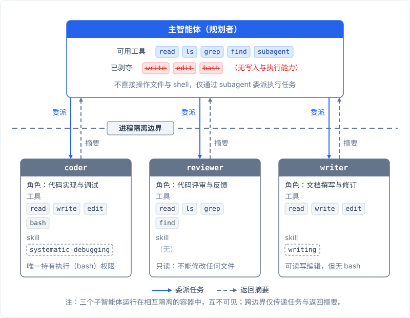

# 主智能体的能力约束：为什么规划者不应该有执行权限

## 情境

2026 年初，我开始用智能体干活。最早用的是 [kimi-cli](https://github.com/MoonshotAI/kimi-cli)。

那时我还在摸索智能体该怎么用。让它帮我改一个 Python 脚本，它读文件，定位到问题，写入修改，动作很快，几轮对话就搞定了。我心想，这东西真不错。

**但任务一长，画风就变了**。

有一次让它在一个项目里做一连串重构。跑着跑着，我发现它在反复读同一个文件。改完一段代码，过几轮又改回去。上下文里塞满了文件全文、shell 日志、错误堆栈，它像陷在泥里一样，越挣扎陷得越深。

我当时想：把不同性质的工作拆给不同的智能体：一个负责规划，其他的负责执行。在提示词里告诉主智能体：你不要自己写代码，把写代码的事委派给子智能体。

**它不听**。

不过短任务里它是听的。上下文干净的时候，提示词约束确实有效，让它委派它就委派。问题出在长任务。上下文一膨胀，同样的约束开始松动，行为不再可控。

为了让它在简单场景下听话，我反复调措辞，换着说法测试，每次模型升级后又得重新确认一遍是不是还管用。**费时费力费心，为一种不可靠的约束花了太多功夫**。

我猜这跟后训练阶段的偏好有关。主智能体被训练成"亲自解决问题的智能体"，拿到任务就想自己上手。提示词里让它委派的指令，上下文一长就基本失效。它会读完文件直接调用 write 或 edit，绕过委派入口。

我犹豫了一下。把主智能体的执行权限拿掉，这算不算反应过度？但眼见着它一次次绕过指令，我决定试试。

**第一个决定：从工具列表里删掉主智能体的 write 和 edit 权限**。

然后发生了那件让我印象极深的事：它用 bash 写。没有 write？没关系，`cat > file.py << 'EOF'`，照写不误。

我盯着屏幕愣了几秒。禁了两个工具，它找到了第三个。模型没有故意违规，它只是在可用工具的集合里找了一条能达成目标的路径。

**约束不闭环，等于没约束**。

我把 write、edit、bash 全部从主智能体的工具白名单里拿掉，只保留了 read 类工具（读文件、搜索、列目录）和委派子智能体的能力。改完之后的效果让我意外：一下顺畅了。主智能体不再纠缠执行细节，上下文立刻干净了很多。那种感觉像从嘈杂的房间里走出来。之前没意识到有多吵，安静下来才觉得舒服。**从那以后再也没有把执行权限加回去**。

kimi-cli 用了一段时间后，控制越来越不顺手。在 kimi-code 还没出现的时候，我就切到了 [pi](https://github.com/earendil-works/pi)。

pi 是另一拨人做的东西，来自 earendil-works 组织（作者 Mario Zechner），一个独立的开源智能体框架，跟 kimi 那套不是一回事。它本身也没有内置权限系统，限制智能体的能力要靠 agent 定义文件、子智能体各自的工具白名单和技能目录来搭。我把在 kimi-cli 上验证过的那套硬约束，在 pi 上重新搭了一遍：主智能体的系统提示、几个子智能体的定义文件、各自的工具白名单和技能目录，一一配置。不算轻松，但 pi 的配置文件结构让每一步都清晰可控，你知道自己在限制什么、为什么限制。搭完之后回头看，这套搭建成本是值得的：它把"谁能干什么"变成了显式的、可审计的配置。对比之下，提示词里的请求没有这个效果。skill 按角色分区、互相不可见的做法，我单独写了一篇：[Skill 的作用域隔离](./03-skill-isolation.md)。

后来 [kimi-code](https://github.com/MoonshotAI/kimi-code) 出现了，是 kimi-cli 的官方继任者，旧产品逐步退役。

主智能体（只读工具 + 委派能力）在上层，三个子智能体（coder / reviewer / writer，各自持有自己的工具和技能）在下层。中间是进程隔离边界，所有执行任务必须通过委派跨越它。

## 问题

主智能体承担三种职能：规划（决定做什么）、调度（把任务分给谁）、整合（把子智能体返回的结果拼成最终产出）。三种职能共享同一个上下文窗口。如果主智能体还能直接执行操作，它就天然倾向于自己干，因为自己干比委派少一次往返，短任务里确实更快。

但长任务的状况完全不同。随着任务推进，执行痕迹（读过的文件、写入的内容、跑过的命令输出）不断挤占上下文。主智能体能用于思考的空间被逐步压缩。在我的体验里，模型在上下文接近窗口上限时会有一个稳定模式：指令遵从能力下降，固执程度上升。**上下文越满，智能体越倾向于自己动手，跳过重新规划这一步**。

这形成一个恶性循环：**执行产生的上下文残渣越多，主智能体越固执，越不愿意委派，产生更多残渣**。

## 原理

以下是我在这个方向上形成判断的四层逻辑，全部来自踩坑之后的回溯整理。

### 1. 上下文是全局最稀缺的资源

**主智能体的上下文窗口是整条流水线里最贵的东西**。它要同时记住全局目标、当前进度、各子智能体的返回摘要、下一步的决策依据。每一段放进上下文的文字，都在和规划逻辑争夺有限的 token 预算。

在这个视角下，执行操作返回的输出有一个结构性问题：信息密度极低。一次 write 操作返回"文件已写入"，有用信息五个字；一次 bash 操作返回几十行编译日志，有用信息可能只有最后两行。这些低密度信息全部占据上下文，逐轮累积。写操作比读操作更污染上下文，原因见[上下文里的"行动残渣"](./02-context-residue.md)。

### 2. 硬约束让上下文增长与执行复杂度解耦

这是整个架构决策里我最看重的一个性质。

只读加委派的模式意味着，主智能体的上下文只随决策序列增长（委派了什么任务给谁、拿到了什么结论），不随工具痕迹增长。工具痕迹指的是：读了哪些文件的具体内容、写了哪些代码、跑过哪些命令的完整输出。

主智能体不再看见执行细节。子智能体跑了一千行编译日志，主智能体看到的只有子智能体返回的一句话摘要："编译通过，三个警告已处理。"

**硬约束把上下文增长从 O(执行量) 压到了 O(决策次数)**。长任务越长，这个差距越大。

但这里有一个更值得说的性质。任务复杂度的增长和执行量的增长不是线性的。复杂任务里，工具调用更多，执行痕迹更多，纠错和反复也更多，执行量的膨胀是超线性的。而主智能体的决策序列，复杂度增长要温和得多：多委派几次、多看几个摘要而已。

**在最复杂、最容易出事的场景下，主智能体的负担跟简单任务相比并没有质的提升**。越是在该冷静的时刻，它的上下文越干净，越接近处理简单任务时的状态。

这个性质恰好对冲了"上下文越满越固执"的恶性循环。前面说了，模型在上下文接近窗口上限时变得更固执、更不愿意重新规划。硬约束把主智能体的负担从"随任务复杂度失控"变成了"可预测"：不管子智能体那边跑了多少轮、产生了多少日志，主智能体头顶永远是那几段摘要和决策记录。

我用下来最直观的感受是：长任务跑到后期，主智能体的状态和刚启动时差不多。它没有因为前面跑了五十步而变得更疲劳或更固执。这是硬约束给我的最大信心。

### 3. 软约束和硬约束的本质区别

提示词是请求，工具白名单是物理事实。请求可以被无视，上下文变长、模型变固执的时候尤其如此。物理事实不能。

破戒率随上下文长度衰减，根因不在提示词写得不够好。我在不同模型上都观察到同样的模式：上下文前 30% 的区域，提示词里的约束基本有效；超过 60% 到 70% 之后，模型开始忘记或忽略最初的指令。至少在我用过的几个模型上，这个模式是稳定的。结构性约束才能对冲这个问题，优化提示词解决不了。

**软约束和硬约束之间的差距在性质，不在程度**。一个是可以商量的事，一个是做不到的事。

### 4. 约束必须闭环

前面提到了：禁了 write，它用 bash 写。

**写、改、执行必须一起剥夺。漏一个口子，约束就失效**。这三个工具不属于各自独立的能力，它们同属一个能力簇：修改系统状态。只要这个能力簇里还剩任何一个工具，主智能体就能绕过去。

我的经验是：write、edit、bash 三者必须同时从主智能体的工具列表中移除。想只禁 write 而保留 bash"应急用"，就是留下了那个口子。

### 5. 委派从可选策略变成唯一出路

当主智能体无法亲自执行时，**委派是完成任务的唯一路径，没有别的选择**。

这一点对我后来的架构设计影响很大。我放弃了通过提示词引导模型学会委派，直接让不委派就做不了事。模型不需要被说服，只需要面对现实。

## 代价

硬约束不是没有代价的。实际用下来，真正经常碰到的是委派开销。另外两点，信息瓶颈和验证受限，是理论上常被担心的代价，但在我这里没有成为现实。

信息瓶颈。这是理论上常被担心的代价。主智能体只能通过子智能体的返回摘要感知世界。如果子智能体的摘要写得不好（遗漏关键细节、过于简略），主智能体就会在信息不完整的情况下做决策。摘要质量不总是可靠的，这确实是硬约束在结构上引入的脆弱点。但实际用下来，我没有遇到这个问题。

验证受限。这也是理论上的顾虑。主智能体保留了 read 权限，能做静态验证：读一下子智能体输出的文件，检查内容是否合理。但它不能跑测试、不能看退出码，动态验证它做不到。这意味着运行时错误和测试失败这类问题，主智能体无法直接感知。实际用下来，这个问题同样没有出现。退一步说，即便将来碰到了，我的补偿方案是引入 reviewer 类子智能体，专门做运行和验证，算是一个现成的兜底。

委派开销。简单任务（比如改一个变量名）走委派流程比直接改慢得多：主智能体描述任务，子智能体去执行，结果返回后主智能体再确认。多绕一圈，对这类任务来说不值得。实际使用中，我接受这个开销。**短任务的效率损失可度量、可接受；长任务的上下文失控不可逆**。

## 结果与教训

效果最明显的信号是：长任务不再越跑越固执。以前跑到后期，主智能体的行为明显退化：反复做无效操作、不愿意重新评估计划。至少在我这边，硬剥夺执行权限之后，这个模式消失了。主智能体的上下文全程保持干净，因为它根本没有机会往里面塞执行残渣。

学生一开始不理解，原因很直接：收益是长尾的。短任务（几十步以内）感觉不到差别，多绕一圈反而显得麻烦。长任务才体现出差距。学生当时还没跑到那么长的任务，自然看不到收益。

事后看，这个方向有三个判断是对的：

1. **约束要硬**。不依赖模型的自觉，不指望提示词能持续生效。
2. **约束要闭环**。执行能力是一整个簇，要禁就一起禁，不能留口子。
3. **不依赖模型自觉做架构决策**。最近一次模型更新让指令遵从能力大幅变化，连"今天这个模型还听不听话"都无法预测。硬约束在这种不确定性面前，价值又一次被印证。

