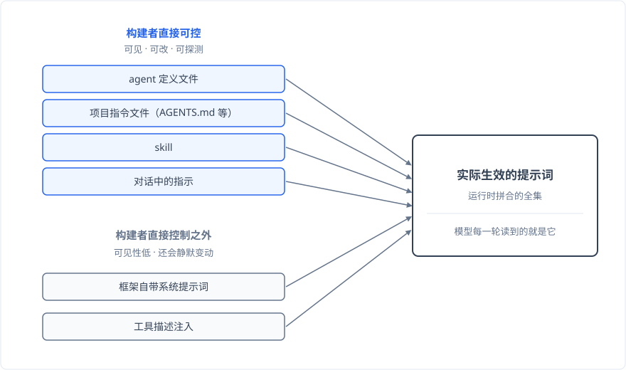
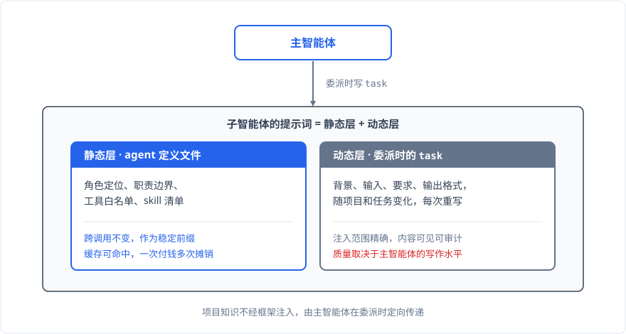

# 提示词的组织原则：你以为的和实际生效的

## 情境

这个系列前几篇谈到提示词时，指的都是我自己写的那部分：`master.md` 里的角色定位、agent 定义文件里的职责边界。这些内容摆在我面前，改了立即生效，我从没觉得提示词有什么玄妙的。

我用 [pi](https://github.com/earendil-works/pi) 搭智能体系统。pi 的系统提示词在客户端拼装，默认那份可以用 `SYSTEM.md` 整体替换，想补充就写 `APPEND_SYSTEM.md`，想验证就把最终发给模型的那份倒出来看。在我的体验里，提示词就是一份摊开的文件，哪里不对改哪里。

Codex、Claude Code 这类框架的提示词组织方式和 pi 不同，这一点我一直知道。但"不一样"具体意味着什么，我没细究过：哪些部分可见、哪些不可见，量级差多少，不可见的部分怎么影响行为，我都答不上来。2026 年 8 月为写这篇文章，我调研了 [Codex](https://github.com/openai/codex) 的提示词组织方式，这个模糊认知才落了地。Codex 的仓库里放着几份提示词文件，文件名看起来就是系统提示词本尊，比如 `gpt_5_codex_prompt.md`。我顺着源码追下去，发现这些文件只是参考副本，仅在测试里被引用，运行时根本不加载。真正生效的那份在服务端，随模型元数据下发，仓库里看不到全貌。

同样叫系统提示词，我在 pi 里看到的就是全部，在 Codex 里看到的只是一部分。**我以为的提示词和实际生效的提示词之间可以有落差，而 pi 碰巧让这两者重合了**。

这个落差值得展开。下文涉及 Codex 的具体细节都以 2026 年 8 月这个调研时点为准，它的模型目录演进很快，数字大概率会过时。另外先说一句：pi 和 Codex 面向的用户和约束不同，这里只对比可见性这个事实，不评判两种设计的优劣。

## 问题：实际生效的提示词从哪来

落差来自一个简单的事实：**提示词是多来源拼合的集合，真正影响智能体行为的是拼起来的全集**。

这些来源大致分两类。一类在构建者的直接控制之外：框架自带的系统提示词、工具描述的注入。另一类是构建者自己写的：agent 定义文件、项目指令文件、skill、对话里临时给的指示。我们平时说"写提示词"，指的只是第二类。

更麻烦的一层是可见性。我原来默认"能看到的才生效"，调研之后才知道**可见性是一条光谱，至少有五个维度**：

1. 位置可知：知道提示词放在哪个文件、哪个字段。
2. 内容可读：打开能看到全文。
3. 生效确认：看到的这份确实是运行时实际用的那份。
4. 可修改：改了能生效。
5. 可探测：运行时能把实际拼装的结果倒出来检查。

拿这五个维度去过一遍 Codex，能看出两个结论。第一个关于仓库里的参考副本：位置可知、内容可读，卡在生效确认这一关。**参考副本这种"假可见"比看不到更隐蔽**：看不到你会去找，假可见让你以为已经看到了。

第二个关于真正生效的那份：它在服务端，只过生效确认这一关，运行时用的确实是它，但位置、内容、探测对构建者不可见，修改也只在 `model_instructions_file` 这个口子上有限可行：能整体替换内置指令，只是默认状态下，构建者看不见也改不了系统提示词的大头。

pi 在光谱的另一端，五个维度全部占满。系统提示词在客户端拼装，`SYSTEM.md` 可以整体替换默认那份，扩展钩子能把最终发给模型的拼装结果倒出来检查。这和 pi 的设计取向有关：核心保持最小，提示词相关的环节全部开放给配置和扩展。

工具描述注入是另一个容易忽略的来源。比如 `apply_patch` 的语法说明，会跟着工具注册一起进入提示词。这类提示词没有人"写"它，它是工具的副产品。

不可见部分还有一个性质：它会静默变动。还是 `apply_patch`：Codex 的老模型把它的用法写成大段文字塞进系统提示词，新模型换了一种结构化的方式注入。同一个工具，注入方式随模型换代整个换掉。**你不动任何配置，实际生效的提示词自己就变了**。

到这里，落差就具体了：我以为的提示词是我写的那几份文件，实际生效的提示词是一个多来源的、相当部分不可见的、还会自己变动的全集。知道这一点之后，怎么组织自己可控的那部分？我拆成三个问题，外加一个追问：该写多长，什么放 skill 什么放提示词，要不要 `AGENTS.md`。

## 判断

### 该写多长：由框架自带的量级决定

先回答长度。我之前的直觉是越短越好，简洁总没错。调研之后我改了主意：**这个问题的答案主要由框架自带提示词的量级决定**。

机制是注意力份额。模型每一轮读到的是拼合后的全部文本，你的提示词占多大比例，大致决定了它的话语权。比如框架自带系统提示词 20KB，你写 2KB，你的声音就只占约 9%。剩下九成是框架写的内容、工具的说明、对话的累积，全在跟你的约束竞争注意力。9% 的份额，约束写得再对也可能被稀释、被淹没。**在这个量级对比下，短不是简洁，是缺席**。

所以重框架和轻框架里的写法完全不同。Codex 老模型的参考副本有 21KB 到 24KB，在这种体量面前，写得短就压不住场，得写长才有存在感。pi 默认的系统提示词很轻，我的体验是，简单的约束写进去就能生效，不用堆量。

重框架里这个效应还会自我加强：你被迫写长，总量变得更大；总量越大，每条约束越容易被淹，于是再加约束、加强调、加示例。**提示词越长就会越长**，一个正反馈螺旋。

螺旋有出口，但不在用户手里。Codex 新模型的参考副本是 6.6KB，比老模型小了一个量级。我的解读是：模型能力变强之后，框架敢减重了，以前必须写进提示词的用法说明，现在靠模型自身的能力就能覆盖。出口开在模型能力和框架设计上，不在用户自己的选择。

最后厘清一个边界。写长解决的是"被淹没"的问题，是参与注意力竞争的入场券，它不解决"约束可靠性"的问题：约束送到了，模型遵不遵循是另一回事。上一篇《[用 TDD 约束智能体](./tdd-for-agents.md)》里那 38 行 TDD 纪律写得够长了，照样被跳过，最后靠流程闸门解决。那个案例属于约束可靠性，跟被淹没无关。

所以连"提示词该写多长"这种看似纯自主的决定，都是由不可见部分定的。这是来源问题的延伸。

### 什么放 skill，什么放提示词：三层漏斗

第二个问题是归属：一段知识，写进提示词，还是做成 skill？我用一个三层漏斗来回答。

第一层过滤：**可靠性要求高、必须执行的知识进结构，不进 skill 也不进提示词**。这是上一篇的结论：提示词和 skill 都是软约束，拦不住模型的偏离。工具白名单和流程闸门才是物理事实，《[主智能体的能力约束](./capability-constraint.md)》讨论过软硬约束的区别，这里不展开。

第二层过滤，问这段知识是否必须保证在场。提示词和 skill 的在场机制完全不同：提示词是系统自动注入的，模型每一轮都读到；skill 只在系统提示词里挂一个名称加描述的清单，完整内容要等模型判断该用之后主动 read 才加载。**提示词的在场是系统保证的，skill 的在场是模型保证的**。角色定位、职责边界、优先级这类缺席就要出事的知识，放提示词；流程知识、领域知识这类缺席只是少个选项的知识，放 skill。

第三层按知识的形态分：

- 长的知识放 skill，按需加载，不常驻摊销到每一轮。
- 易变的做成 skill 独立存放，改动不伤常驻层。
- 角色专属的跟随角色静态分区，正好配合《[Skill 的作用域隔离](./skill-isolation.md)》的做法。
- 全角色通用的进提示词。

三层之外还有一个性能判据，我在子智能体上体会很深：**需求确定的常量知识放系统提示词，按需的变量知识放 skill**。专一任务的子智能体是常量知识的典型：它每次被委派都干同一类活，需要同一批知识。这批知识如果做成 skill，每次委派都要多一轮 read 工具调用，多消耗对话轮次，还会破坏多次调用之间的前缀缓存命中：系统提示词是稳定前缀，可以缓存；skill 是中途 read 进来的，每次都要重新算。一句话：**放系统提示词是一次付钱多次摊销，放 skill 是每次重新付钱**。skill 隔离那篇从省掉加载步骤和缓存命中的角度论证过常驻知识进系统提示词，这里是同一个判据在子智能体多次调用场景下的深化，那边写过的我不重复。

### 要不要 AGENTS.md：分情况，我的选择是不要

`AGENTS.md` 是项目指令文件的代表，两个框架都支持，行为也类似：从目录层级里逐层查找、全部拼接。Codex 从项目根一路找到当前目录，越靠当前目录越优先，上限 32KiB，超出截断，以 user 角色注入；pi 从当前目录向上找，全局的还有一份，全部拼进系统提示词。要不要用它，我的答案分情况。

以单个项目为入口启动智能体时，`AGENTS.md` 可以有。项目知识是每次会话的常量：目录结构、构建命令、代码规范，每次都用得上。写进去直接常驻注入，省掉智能体每次自己探索的工具调用和对话轮次，还能命中缓存。这是性能判据的直接应用。

以一个大工作区为入口时，我不建议有。我在 pi-workspace 这类工作区里干活，一个目录下挂着多个项目，智能体在工作区根目录启动。`AGENTS.md` 逐层查找、全部拼接，放在根目录意味着所有项目的所有会话都注入同一份内容，而每次会话实际干活只涉及其中一个项目，其余全是噪音。放到每个项目自己的目录里可以，但那要求每次都进项目目录启动，跟我的工作方式不合。

更深一层的问题是注入范围。**`AGENTS.md` 的内容可见可控，注入范围却不可控**。框架默认把它注入每一个智能体，主智能体和子智能体都有份，除非显式禁用。子智能体是专一角色、高频调用，项目级知识对它们基本是噪音：coder 不需要知道另一个项目的构建命令。按性能判据算，这是一笔每次调用都在付、却买不到东西的成本。设计 `AGENTS.md` 内容的时候，必须把这笔隐性成本算进去。

所以**我现在的做法是没有 `AGENTS.md`，也没有 `SYSTEM.md`**。pi 默认的系统提示词本来就轻，我没有替换的需求；项目知识不进 `AGENTS.md`，从哪来？这是下一节的事。

### 动态提示词构建：项目知识靠委派传递

答案藏在子智能体的提示词结构里。拆开看，子智能体的提示词由静态层和动态层组成。

静态层是 agent 定义文件：角色、职责边界、工具白名单、skill 清单。它跨调用不变，作为稳定前缀能命中缓存。动态层是主智能体每次委派时写的 `task`：背景、输入、要求、输出格式，随项目和任务变化，每次都不一样。

动态层就是项目知识的入口。项目知识不靠框架注入，由主智能体在委派时按需提炼、定向传递。和 `AGENTS.md` 式的框架注入比，两条路径的取舍很清楚：框架注入的思考成本是零，写一次永久生效，但注入范围不可控，对专一子智能体大部分是噪音；动态传递把思考成本放在主智能体身上，每次委派都要想清楚这次该给什么，换来的是注入范围精确，只给需要的子智能体、只给本次任务需要的知识，内容完全可见、可审计。

**没有 `AGENTS.md` 也能干活，前提是主智能体在委派时承担了知识提炼和传递的责任**。这和《[上下文里的"行动残渣"](./context-residue.md)》讲的上下文保洁正好是一对镜像：执行残渣留在子智能体的上下文里不上传，项目知识由主智能体提炼之后下传，两条路径互补，**主智能体的上下文里始终只装高价值信息**。

代价也很直接。**动态层的质量就是主智能体的写作质量**。委派描述写不清楚，子智能体就在缺上下文的状态下干活，输出质量跟着打折。《[上下文决定智能体的上限](./context-matters.md)》里"给足关键信息"的判断在这里同样成立，只是发生在委派这个动作里。我写 `task` 时会刻意带上背景、输入位置、期望的输出格式和约束条件。在我的体验里，写不清楚的时候子智能体的输出确实会差一截，这个规律是稳定的。

到这里，我的提示词组织方式就完整了：没有 `AGENTS.md`，没有 `SYSTEM.md`，角色和边界写在 agent 定义文件里，领域知识在 skill 里按角色分区，项目知识在委派时动态传递。

## 结果与教训

调研带来的最大改变，是提示词管理的对象变了。以前我以为管的是自己写的那几份文件，现在我知道，可控的只是少数，组织好这少数的前提是承认多数的存在。

三个问题加一个追问，答案都绕回了可见性。来源是根：大量提示词不可见，可见性是有五个维度的光谱，假可见比不可见更隐蔽。该写多长，由框架自带的量级决定，重框架里短等于缺席，螺旋的出口在模型能力。归属按三层漏斗走：必须执行的进结构，必须在场的交给提示词，性能上常量常驻提示词、变量做成 skill。`AGENTS.md` 分入口：项目入口可以有，大工作区入口不建议，注入范围不可控这一点，正是可见性落差在可控侧的倒影。追问由委派传递接住：范围精确，内容完全可见、可审计。

还有两条教训值得单独说。

第一，**选框架先看它把多少提示词摊开**。可见性本身是一种架构特性，影响后面所有决策。如果你用的框架看不到系统提示词，至少想办法确认一次实际生效的全貌，比如用框架提供的调试钩子，或者抓一次真实的请求看看。连自己智能体实际用什么提示词都不知道，谈不上组织原则。

第二，对不可见部分的静默变动保持敏感。模型换代、框架升级，你写的提示词一个字没动，实际生效的全集可能已经变了。我的习惯是，模型或框架有大版本更新时，重新确认一遍自己的约束还有效。Codex 的具体细节是 2026 年 8 月的快照，演进很快，大概率会过时；可见性光谱、注意力份额这些机制层面的判断，我觉得会耐用得多。
