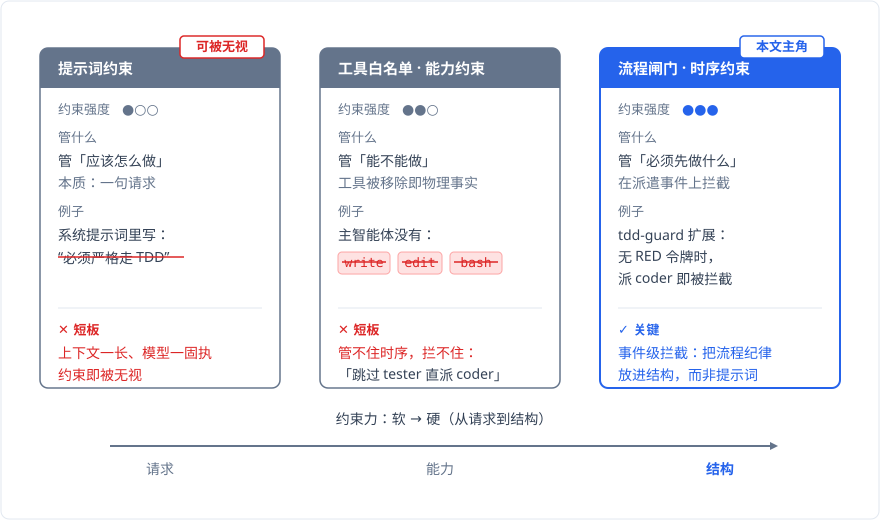
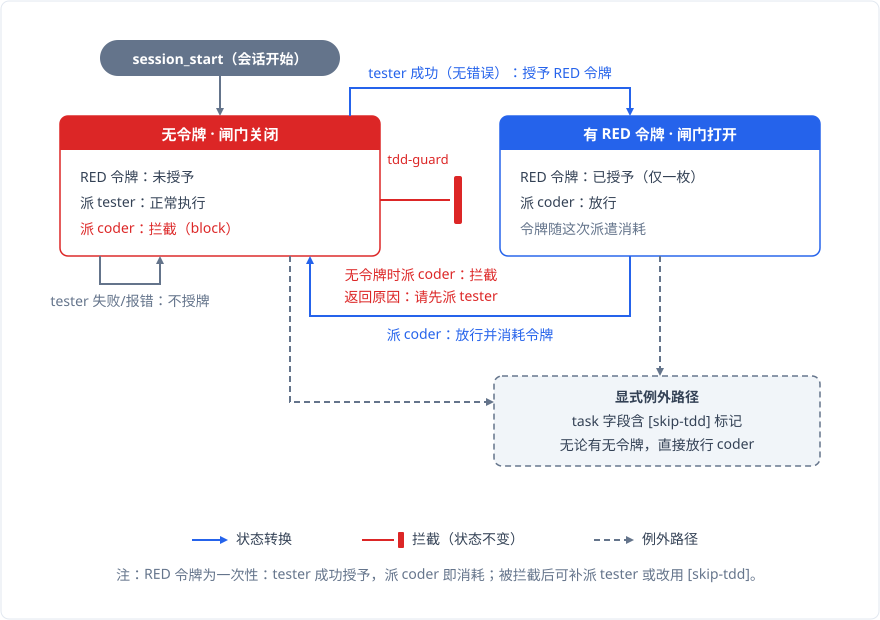

# 用 TDD 约束智能体

## 情境

[deepseek-v4-flash](https://chat.deepseek.com/) 正式版发布之前，有一段时间我拿它做主智能体。那个版本的指令遵循能力不太稳定，在 TDD 流程这件事上表现尤其明显。

当时我的系统里已经有 tester、coder 和 reviewer 三个子智能体，期望的流程是 tester 先写失败测试、coder 实现功能、reviewer 审查变更。为了让主智能体走这套流程，我在系统提示词（`master.md`）里塞了大量 TDD 纪律文字：RED/GREEN/REFACTOR 强制循环、各阶段归属判定、强制触发规则，加起来约 38 行。还专门配了一个 TDD skill，把每一步该做什么写得清清楚楚，作为软提醒。

**效果时灵时不灵**。

短任务里勉强走对流程。任务一长，主智能体就开始跳过 tester，直接把 coder 派出去写代码。提需求时我当场说了一句："现在你的子 agent 系统之内有 tester、coder 还有 reviewer，但你经常会忘记 TDD 的开发原则。"那段时间我还在反复调整提示词里 TDD 段落的格式，表格改成编号列表，编号列表又改回表格，试图找到模型更容易理解的写法。

**为了一个不可靠的约束反复调格式，这件事本身就说明问题了**。需要靠措辞和排版来撑着的纪律，本质上不是纪律。

## 判断：TDD 为什么适合约束智能体

TDD（测试驱动开发）从需求出发。开发之前先想清楚"这段代码应该做什么"：比如一个排序函数，输入 [3,1,2] 应输出 [1,2,3]。TDD 的第一步是把"应该怎样"写成测试断言（`assert sort([3,1,2]) == [1,2,3]`），测试文件就是需求的白纸黑字。

然后是 RED → GREEN → REFACTOR 的节奏。先写测试，此时实现还没写，测试当然失败。**这个失败是好事**：它证明测试真的在检验需求——考卷全是送分题就考不出水平。确认测试有效后，写最少代码让它通过，防止一次性堆进没验证的逻辑。最后，在测试全绿的保护下重构（重命名、拆函数），测试保证行为没变，改起来不慌。

对应到我的子智能体系统：tester 写失败测试（RED），coder 实现让测试通过（GREEN），reviewer 审查变更。

**TDD 对智能体有一个独特的好处：测试把模糊需求变成了客观的验收标准**。智能体不用猜"这样算不算做完了"。测试通过就是通过，失败就是失败。上一篇《[主智能体的能力约束](./capability-constraint.md)》里讨论过主智能体"验证受限"的代价：它保留了 read 权限能静态检查文件，但跑不了测试、看不到退出码，动态验证做不到。在这个限制下，测试失败是主智能体最可靠的反馈信号。"这个断言没通过"，客观、无歧义，比任何主观判断都管用。

另一个好处是需求显性化。tester 被派出去写测试的时候，必须把需求翻译成具体的测试用例。模糊的想法在这一步被转成可验证的断言。主智能体读到 tester 返回的测试文件，就知道 coder 的目标已经写清楚了，不再需要自己脑补。

## 问题：能力约束管不住时序

但问题是：怎么让主智能体老老实实走这个流程？

上一篇《[主智能体的能力约束](./capability-constraint.md)》里详细讨论了**软约束和硬约束的本质区别**：提示词是请求，工具白名单是物理事实。请求可以被无视，上下文变长、模型变固执的时候尤其如此。物理事实不能。这里不重复展开。

但 TDD 暴露了一个新问题：**能力约束管得住"能做什么"，管不住"先做什么、后做什么"**。

工具白名单能禁止主智能体自己写代码、跑命令。但它拦不住主智能体跳过 tester 直接派 coder。"派 coder"本身在工具列表里完全合法，白名单只管"哪些工具能用"，不管"工具按什么顺序用"。跳过 tester 不触碰任何工具权限，白名单层面畅通无阻。

而系统提示词里那 38 行 TDD 纪律白纸黑字要求先 tester 后 coder。规则是有的，只是拦不住。提示词是软约束，上下文一长模型照样跳。

白名单管不到，提示词禁止了但拦不住。两条路径在时序面前都失效了。

提示词完全能表达这个条件：写一句"必须先派 tester，再派 coder"就行。但表达不等于执行。会不会照做，取决于模型的指令遵循能力，deepseek-v4-flash 那个版本在这方面就很不稳定。而 TDD 的收益太大了：客观验收标准、最可靠的反馈信号、需求显性化，每一项都实实在在。收益太大，值得为它上硬约束，不能押在模型的自觉上。

当时主智能体自己也有过反思。它说 skill 只是 checklist 类的软提醒，"relying on the agent to remember to read it is precisely the problem we're trying to solve"。靠智能体记得去读 skill，正是我们要解决的问题本身。

**提示词请求走流程，skill 提醒别忘了走流程，说到底都是软约束**。时序条件需要一个硬的东西来执行。

## 决策：流程闸门，约束的第三种形态

能力约束之后，流程纪律也需要硬的落地方式。做法是把 TDD 的时序条件做成一个流程闸门：不满足前置条件，操作在委派层就被拦截。

**流程闸门是约束的第三种形态**。前两种分别是提示词（请求）和工具白名单（能力），各自管不同层面：提示词管"应该怎么做"，工具白名单管"能做什么"，流程闸门管"什么时候能做"。

沿着这个思路，我写了一个 [pi](https://github.com/earendil-works/pi) 扩展：[tdd-guard](https://github.com/Wolido/tdd-guard)。它的机制不复杂：一个 RED token 的一次性状态机，拦在子智能体委派层。

规则只有几条：

- tester 无错误成功完成时，授予一枚 RED token。
- 下一次 coder 委派消耗这枚 token。token 用完即废，每次 coder 调用都需要前一轮有新的 tester 成功。
- tester 失败（测试语法错误、跑不起来）不授予 token。主智能体必须重新派 tester，直到它写出合法的失败测试。
- session_start 时 token 重置。
- 拦截时不弹窗、不阻断。tdd-guard 返回一条拦截原因，主智能体自己读到之后决定下一步。**拦截是信息，不是拒绝**。
- task 字段里包含 `[skip-tdd]` 标记时可以显式跳过，跳过时必须写明理由。

**tdd-guard 本身是用 TDD 开发的**。我先让 tester 按 7 条行为规约写了失败测试（RED），再让 coder 实现逻辑，首轮 15 个测试全部通过。reviewer 审查后发现实现有遗漏，打回要求补测。tester 又补了 9 个失败测试，coder 修完后 24/24 全绿，reviewer 复审通过。

装上 tdd-guard 之后，`master.md` 里那约 38 行 TDD 纪律缩成了 2 行：

> 使用 tester, coder 和 reviewer 组成完整的 TDD 开发流程。coder 执行完毕后必须使用 reviewer 审查。

**结构做的事，提示词不用再说一遍**。

## 结果与教训

装上之后跑了一段时间，拦截记录很有说服力。一次典型的拦截原文：

> 已拦截：当前调用 coder 子代理违反 TDD 流程——本轮尚无 tester 成功完成（RED 阶段缺失）。请先派遣 tester 子代理编写失败测试（RED），待其成功完成后再调用 coder 实现功能。如确需跳过 TDD，请在 task 中加入 [skip-tdd] 标记并写明理由。

拦截后的行为模式很稳定。纯文档或纯内容类任务被拦之后，主智能体会主动加 `[skip-tdd]` 并写明理由："纯文档写作任务，没有可写的测试"。代码任务被拦后老老实实先派 tester。有一次 reviewer 抓出了 coder 输出里的事实错误：DNS 解析发生在内核空间还是用户空间，coder 写错了，reviewer 指出来，coder 返工修正。**流程闭环真实运转起来了**。

三条教训：

**第一，流程纪律属于结构，不属于提示词**。不是提示词写得不好，是这种东西本来就不该放在提示词里。流程的强制性应该来自执行层，而不是措辞层。tdd-guard 只是一个简单的状态机，但它插在委派层而不是提示词层。这一点决定了它有效。

**第二，拦截的真正意义，是让例外显式化**。每次 `[skip-tdd]` 都要写明理由，理由本身就成了上下文的一部分。主智能体在写作任务里写"没有可写的测试"，这个判断对不对、有没有遗漏，后续可以审视。例外从"悄悄跳过"变成"声明跳过"，**可审计的例外比无声的绕过安全得多**。

**第三，约束分形态，各管各的**。提示词管的是意图层面，工具白名单管能力边界，而流程闸门管的是时序——三者各管一层，互相不能替代。我在 TDD 这件事上交了一圈学费才搞清楚：**换一种约束形态，比换一种措辞有效**。

在我的体验里，tdd-guard 改变了 TDD 流程的可靠性。模型并没有变听话。变化在于它不按流程走就得说明理由。我用下来最直观的感受是：以前每轮都得盯着看它是不是跳了 tester，现在不用盯了——跳了会有拦截记录，加 skip 会有理由。**把监督从人脑里卸下来，装进流程里**，这才是约束该做的事。
