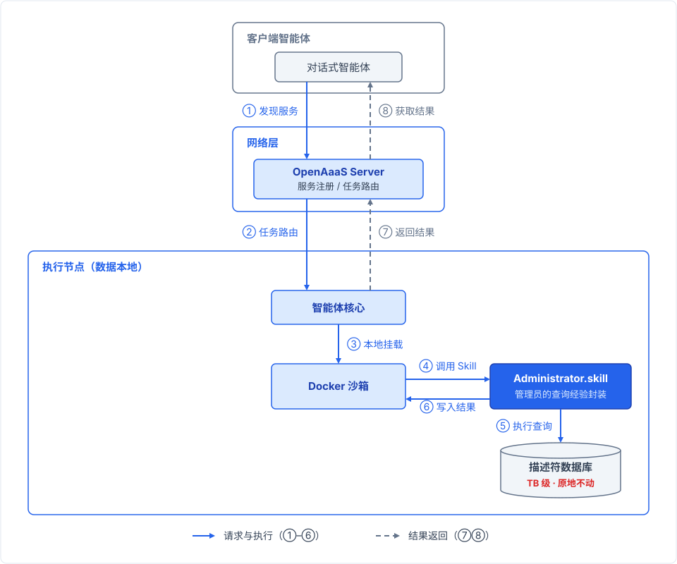

# 不搬数据，蒸馏 Administrator.skill：OpenAaaS 的范式转移

> 本文是 [OpenAaaS](https://github.com/Wolido/OpenAaaS) 项目的设计博客，原文于 2026-05-16 发布在 [GitHub Discussions #57](https://github.com/Wolido/OpenAaaS/discussions/57)，此处收录中文版本（原文为中英双语，英文部分从略）。

材料领域的数据共享已经走了二十多年。从材料基因组计划到各类专业数据库，我们见证了标准化格式、统一元数据规范和集中式平台的巨大价值：这些工作让无数研究者受益，也奠定了今天材料信息学的根基。但我在数据基础设施一线踩坑时也观察到，**面对某些类型的数据，这套成熟模式会碰到结构性天花板**。

第一个是格式转换的隐性代价。把原始数据清洗成统一格式，本身就是一次信息筛选：被判定为“噪声”的信号会被丢弃。但在机器学习驱动的材料发现里，今天丢弃的“噪声”明天可能就是关键特征。**标准化的收益是确定的，损失却往往事后才察觉**。

第二个挑战来自数据规模与探索性的矛盾。面对万级、亿级、万亿级规模的原始数据，我们没法预先知道需要的数据具体在什么位置，更无法直接把数据压缩为知识。这意味着理论上需要全量数据在场，而全量集中传输在物理上又常常不现实。

第三个挑战或许更根本：数据一旦脱离原始环境，文件系统的目录语义、配套脚本生态、管理员的隐性知识会同步流失。剩下的数据本身是完整的，却可能变成失去上下文的孤立数字；重建这些上下文，有时比重新采集数据还难。

OpenAaaS 的思路是：**与其让数据搬家，不如把管理员的经验蒸馏成一个可网络调用的 skill**。

## 统一格式 = 转换 + 清洗 = 必然有损

统一格式的挑战不止在技术层面，它对原始数据做的是一次**有损压缩**。

任何统一流程都绕不开 ETL 的三个环节：Extract、Transform、Load，即提取、转换、加载。Transform 意味着选择：保留什么字段、丢弃什么信息、如何映射编码。谁来决定“什么不重要”？这个决定本身就是主观的，取决于当下的分析需求。

一个具体的例子：某仪器输出的原始日志中包含大量环境参数和传感器噪声读数。在当前的共享流程中，这些通常会被清洗掉，因为“常规分析用不到”。但明天的深度学习模型，可能恰恰要从这些噪声里提取样品稳定性的关键特征。**材料数据的丰富性恰恰在于它的“冗余”**：不同下游任务需要不同的信息切片。

**统一格式意味着用一个主观的标准去裁剪客观的丰富性**，损失从流程设计上就不可避免。

## 必须全量在场，但全量传输不可能

材料数据分析的一个根本特征是：**你无法预先知道哪部分数据是重要的**。

探索性分析、异常检测、假设检验、跨维度关联，这些任务的本质是“你不知道关键信息在哪里”。在高熵合金的万亿级描述符中搜索反常稳定相，你不知道哪些成分组合异常，必须先做全局统计；在分子动力学轨迹中定位相变事件，你不知道它发生在哪一帧，必须扫描全轨迹。

“只传需要的部分”在逻辑上不成立：**你需要全部数据在场，才能判断哪部分是需要的**。

**17.4 TB 数据要传 17.7 天，100 KB 的分析脚本只要几毫秒**（[arXiv:2605.13618](https://arxiv.org/abs/2605.13618)）：后者才是唯一可行的路径。规模壁垒的本质在于一对矛盾：分析要求全量数据在场，而全量传输在物理上不可能。

## 传输即元数据丢失

元数据的损失与“忘填表单”式的疏忽无关，它是物理迁移的必然结果。

第一层是文件系统语义。目录结构、命名约定、时间戳序列，本身就是实验逻辑的外化。传输时目录被扁平化或重构，语义立即断裂。

配套文件生态是第二层。数据文件旁边通常有实验日志、仪器配置文件、后处理脚本、失败尝试的记录、组内 README。传输流程往往只挑“主数据文件”，这些配套文件被系统性地遗漏。

第三层藏得最深，是管理员的隐性知识。管理员知道“这批数据在 2024 年 6 月之后可信，因为之前探测器有漂移问题”；知道“这个字段在旧版本软件里是反的”；知道“OUTCAR 里的某个警告可以忽略，另一个不行”。**这些知识从未被写入任何文件，却决定了数据能否被正确使用**。

**数据一旦离开原环境，三层元数据同时丢失**。剩下的只是孤立的数字，“怎么来的”和“怎么用”的完整图景都没了。

## Administrator.skill：让最懂数据的人原地服务

**数据的最大价值在懂数据的人身上**。

材料数据高度领域化。一个高熵合金描述符数据库的管理员，花三年时间理解哪些查询有物理意义、描述符之间的相关性有多强、哪些结果其实是 artifacts。一个 TEM 仪器管理员，知道不同制样方法对图像对比度的影响，知道哪些“缺陷”其实是制样损伤。这些知识无法被编码进数据文件，也无法通过文档完全传递。

传统开放模式要求管理员把数据整理好、写成标准格式、填好元数据、上传平台。这强迫管理员做大量与科研无关的适配工作。更糟的是，数据开放后，外部用户因为缺乏领域知识往往“用不好”：他们用错查询方法，带着错误假设解释结果，关键的边界条件也常常被丢在一边。

Administrator.skill 的核心思想是：不搬数据，也不强迫管理员做格式转换。管理员要做的是把自己的分析能力封装成一个 skill。**这个 skill 装着管理员对数据的理解、最佳查询实践、结果解释逻辑和边界条件检查**。外部用户通过智能体调用这个 skill，不需要理解底层数据格式，也不需要搬运数据。**他们拿到的是管理员的分析服务，自始至终没有数据副本**。

这个模式的好处落在三方。管理员专注科研，无需做 ETL 和文档维护；用户拿到专家级的分析结果，不用自己解读原始数据；数据零迁移，元数据零损失。

## OpenAaaS 的设计

把前面的问题逐条对应，OpenAaaS 的设计如下。

| 设计 | 解决的问题 | 具体机制 |
|---|---|---|
| 免规范化接入 | 格式有损 | 不转换数据，保留原始格式。管理员定义能力接口（skill），外部通过 skill 调用 |
| 近数据端计算 | 全量传输不可能 | 分析脚本传到节点，原地全量分析。Docker 沙箱隔离，单向 HTTP 出站 |
| 数据与上下文绑定 | 元数据丢失 | 数据、配套文件、管理员知识都在本地。元数据不丢失，因为从未被拆分 |
| Administrator.skill 作为网络服务 | 用户缺乏领域知识 | 管理员注册服务、暴露能力接口。智能体渐进式发现：`list_services` → `get_service_usage` → `submit_task` |

**用户不需要学习数据格式，只需要描述需求**，智能体调用 skill 完成分析。

## 案例：万亿级高熵合金描述符数据库

数据特征：500 亿条记录、10 万亿个数据点、17.4 TB 存储。

传统开放模式的问题很直接：

- 管理员被迫转换格式、全量上传、重建索引、写标准化文档，还要反复回答“这个数据怎么用”
- 外部用户拿到数据后，不懂描述符的物理边界和索引结构，也不知道哪些查询有实际意义，结果是用不好

OpenAaaS 的做法：

- 把管理员的内化理解封装成一个 skill
- 数据原地不动，专有索引直接使用
- 外部用户通过智能体调用：描述需求 → skill 执行查询 → 返回结果
- 用户获得的是管理员的分析能力，不接触数据副本
- **网络只传 KB 级指令和 MB 级结果，17.4 TB 数据从未移动**

## 结语

材料数据共享的范式需要转移：从“搬数据”转向“蒸馏管理员”。OpenAaaS 无意建立一个统一的中央数据库，它要做的是让最懂数据的人在原地提供服务。**数据留在原地，流动的是能力**。
