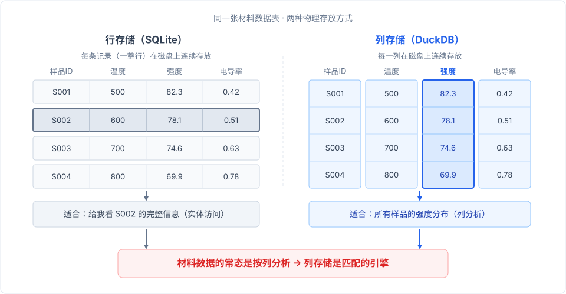
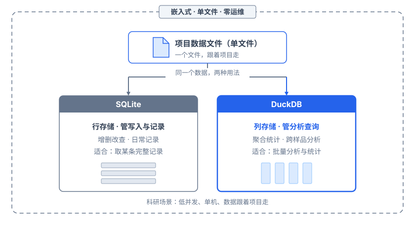

# 理工科科研，该用什么数据库？

技术社区的答案出奇一致。你看教程、技术文章、招聘要求、面试题库，"项目用什么数据库"的答案几乎总是 PostgreSQL（这几年）或 MySQL（前几年）。这个主流叙事太强了，强到让人觉得不用这些就等于没正经做项目。

但科研场景真的适合这两个吗？

## 科研场景到底需要什么

先把具体的数据库放一边，看看科研数据管理的实际条件。

做实验、跑计算、整理数据，这些事基本是一个人或者课题组几个人在做。**并发极低：同一时间最多几个人读写，不存在几百个用户同时请求的场景**。数据也不需要对外暴露成网络服务，它是课题组内部使用的。数据量呢？实验记录、计算输出、样品台账，几十万行到几百万行，单机硬盘完全扛得住。

这些条件加起来，指向一个简单的结论：**科研场景不需要装一个数据库服务，只需要一个数据库文件**。

PostgreSQL 和 MySQL 的强项是高并发连接管理、网络服务架构、细粒度权限体系、多租户隔离。这些是 Web 应用的核心痛点：几百上千用户同时访问，数据安全和隔离是刚需。但科研场景恰好不碰这些：没有高并发，不需要网络暴露，权限管理就是课题组几个人商量着来。

**PostgreSQL 的强项恰好是科研用不到的**。它换来的代价却是科研人员最不想干的事：安装数据库服务、管理后台进程、配置用户权限、处理网络连接。全是运维负担。这些事对运维工程师是日常，对做材料的科研人员是额外的功课，跟研究本身毫无关系。

那科研该用什么？就我在材料领域的观察，知道 SQLite 的人不多。想了解"科研该用什么数据库"，去网上看教程、技术文章或问 AI，几乎都会被引向 PostgreSQL 或 MySQL。SQLite 根本不会出现在答案里，它压根不在讨论范围内。

但回头看看 SQLite 的特性：不用安装，不用配置，也谈不上维护。**它就是项目目录里一个 .db 文件，Python 内置支持，打开就能读写**。备份拷走文件就行，迁移同理，共享直接发到群里。不用起服务，不用开端口，也无需设密码。这些恰好匹配科研的需求：单机、小团队、数据跟着项目走。

而且这个判断在 AI 时代还有一个加分项。

我在这套环境里也用智能体干活，让智能体帮我整理数据、查实验记录、生成分析报告。用下来发现，智能体跟科研人员处境一样：单机、低并发、数据跟着项目走。**对智能体来说，SQLite 单文件比 PostgreSQL 远程服务顺手得多**。文件位置明确，智能体一眼知道数据库在哪；零运维意味着没有"服务没起""端口冲突"这类跟任务无关的意外；Python 生态原生支持，工具链不需要额外折腾。这一点跟[上下文决定智能体的上限](../agents/context-matters.md)里聊的一致：给智能体的上下文越直接、路径越短，它表现越好。SQLite 单文件的直接性，让智能体跟数据的交互路径最短。

## 存得下，算不动

SQLite 管住了存储，但管不住分析。

根源不在 SQLite 的代码质量，而在存储形态。**SQLite 是行存储数据库，设计假设是"一条记录等于一个完整实体"**：用户、订单、交易。查"某个用户全部信息"时一次读出那一行，高效直接。这是 Web 应用最常见的读写模式：增删改查围绕实体走，行存储天然匹配。

材料数据的长相不同。

一个材料样品一行装不完。它天然分层：一个样品对应多个批次，每批做多次测量，每次测量输出多个性质。这是父-子一对多结构，不是一张扁平表。而且每次实验输出的是"列"的集合：光谱有几百个波长通道，热处理有几百个时间点的温度序列，第一性原理计算跑出一大堆性质参数。分析时关心的是"所有样品在 500°C 下的强度分布""不同掺杂比例对应的带隙变化"。**全是跨记录、按列维度的聚合和对比**。

行存储为实体导向设计，材料数据的分析是列导向的。这就是错位。SQLite 当然能存，任何数据都能塞进表里，但按列算不是它的天然形态。一个跨几千条记录计算某列统计量的查询，行存储要逐行读完再提取目标列，IO 浪费大。更不用说材料数据规整成表之后往往是宽表：几十上百列，每列代表一个性质或参数。**宽表的分析查询在行存储上跑，体验就是慢**。

## 另一个嵌入式数据库

DuckDB 在这个节点上进入了我的工具箱。

DuckDB 跟 SQLite 有一个关键共同点：**它是嵌入式数据库——单文件、零配置、零运维，同样不需要装数据库服务，一个文件就是全部**。但设计目标完全不同。SQLite 为事务型负载优化，处理一行行的增删改查；DuckDB 为分析型负载优化，处理跨全表的聚合计算。

两个技术决策让它做到了这一点。

第一是列存储。**列存储把同一列的所有值存在一起**，跟行存储按行排列数据正好相反。查询"所有样品在 500°C 下的强度"时，行存储要扫全表把每行的温度列和强度列都读出来；列存储只读温度列定位目标行，再读强度列取数值。对照上面的图就能直观看出，为什么列存储恰好匹配材料数据的分析模式：你关心的几乎总是"某几列随条件怎么变"，极少是"某一个样品的全部信息"。

第二是向量化执行。传统数据库一条条处理行，DuckDB 一次处理一批（一个向量），利用现代 CPU 的 SIMD 指令和缓存预取，把计算密度拉上去。**在我的体验里，同样的分析查询，DuckDB 比 SQLite 快一个量级**。跑完查询你就能明显感觉到快，不需要精确基准测试来告诉你差了多少。

而且 DuckDB 的科研友好程度超出预期。Python 集成极好：能直接查 pandas DataFrame、Parquet 文件、CSV 文件，不需要先导入。最让我意外的是它可以直接查询 SQLite 文件：用 DuckDB 的 sqlite 扩展 attach 一个 .db 文件，就能跨库做分析查询。**SQLite 存数据，DuckDB 做分析，天然无缝**。日常实验记录、样品台账继续往 SQLite 写，需要大规模聚合分析时 DuckDB 直接读 SQLite 文件来算，不需要导出导入，不用维护两套数据。

到这里，两条线汇合了。SQLite 和 DuckDB 都是嵌入式、单文件、零运维，**在"不需要装数据库服务、一个文件就够"这一点上，两者完全一致**。区别只在于各自管一段：SQLite 面向存储和事务，DuckDB 面向分析和查询。

## SQLite 存，DuckDB 算

回头看最初的问题：理工科科研该用什么数据库？

日常记录、写入、事务，用 SQLite。稳定、简单、嵌入，Python 原生支持，一个文件跟着项目走。

分析查询、聚合、探索，用 DuckDB。列存储、向量化执行，同样是单文件零运维，而且能直接查 SQLite 文件。

**两个嵌入式数据库，覆盖科研数据的全部需求，全程零运维**。

这个方案没有 PostgreSQL 的高并发网络服务，没有 MySQL 的多用户权限体系，没有 Redis 的缓存加速。因为科研场景不需要这些。**别被主流叙事带着走，先想清楚你的项目需要什么，再决定用什么**。
