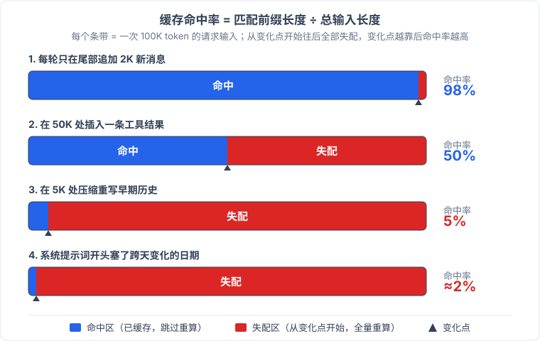

# 《为什么缓存命中率差异巨大》— 同一个任务，不同的请求流

[上一篇《什么是缓存命中》](./what-is-cache-hit.md)讲了缓存的基础机制：前缀逐字符匹配、命中后跳过 prefill、账单上命中读取只要输入价的十分之一甚至更低。那篇文章的最后一句只落到一个行为建议：把不变的钉在提示词开头。

这个建议没错，但太粗了。真实世界里，同一个模型、同一个任务、甚至同一个 API 网关，不同的 AI 编程智能体之间缓存命中率可以差出一倍以上。上一篇的模型解释不了这个差距。

[Requesty 网关](https://www.requesty.ai/coding-agent-economy) 2026 年 4 月做过一次同口径实测，走同一个 Anthropic API，结果很直白：

| 工具 | 缓存命中率 | 平均每请求输入 token |
|------|-----------|-------------------|
| Claude Code | 92% | >200K |
| Kilo Code | 46% | 62K |

[Claude Code](https://github.com/anthropics/claude-code) 的命中率是 [Kilo Code](https://github.com/kilocode/kilocode) 的两倍。与此同时，[OpenCode 官方披露](https://opencode.ai/data/) 7 天全量用户数据的命中率是 94.9%。而 [OpenAI Codex 的原生链路](https://github.com/NousResearch/hermes-agent/issues/47335)甚至到了 98.2%。但同一账号、同一模型，经第三方客户端删掉 `session_id` 和 `x-client-request-id` 两个路由头之后，命中率崩到 13-30%，恢复这两个头又立刻回升。

这些差距不能全归因于模型。Hermes issue 里的对比最干净：同一个 GPT 模型、同一个账号，原生链路 98.2%，经第三方客户端删掉路由头后崩到 13-30%。Requesty 的同口径实测也指向同一个方向，同样走同一个 Anthropic API 网关，Claude Code 能到 92%，Kilo Code 只有 46%（Requesty 未披露两者是否锁定同一具体模型）。**缓存命中率由请求序列的工程结构决定**。

## 先把上一篇的模型 bug 修掉

上一篇留了一个需要细化的结论："前缀一动，全部作废"。这句话在直觉层面没错，但容易让人误解成缓存非黑即白：要么全命中，要么全归零。实际情况比这个连续。

准确的说法是：**命中率 = 匹配前缀长度 / 总输入长度，从变化点开始往后失配，变化点之前的部分仍然命中**。

不同厂商的实现方式不一样，但逻辑一致。DeepSeek 和 OpenAI 用的是自动前缀匹配：从第 0 个 token 开始逐 token 比对，遇到第一个不同的 token 就停，之前的部分命中、之后的重算。Anthropic 用的是断点缓存：在提示词里手动标记断点，每个断点块的缓存 key 是从开头到该断点的完整前缀，变化点之前的断点块命中，之后的失配。不管哪种实现，前缀失配都只损失变化点之后的部分。

用数字说更清楚。假设一段 100K token 的历史会话，每轮只在尾部追加 2K 新消息：命中率 98%。在 50K 处插入一条工具结果：命中率 50%。在 5K 处压缩重写早期历史：命中率 5%。在系统提示词开头塞一个跨天变化的日期：命中率约 2%（示意数字）。TTL 过期或者请求路由到另一台没有缓存的机器：这才是真正的 0%。

所以上一篇说的"前缀一动，全部作废"，更精确的版本是：变化点之前的照常命中，之后的全部作废。**95% 命中率意味着每轮变化点都在尾部 5% 处**。"归零"只在两种情况下发生：变化点极靠前，或者缓存整体不存在。

## 同一任务，不同的请求流

机制修好之后，再看工具间的巨大差距，原因就清楚了。**同一个任务经不同工具变成完全不同的 API 请求流**。 同一个用户输入"帮我重构这个函数"，Claude Code 发出去的 HTTP body 和 Kilo Code 发出去的，是两份完全不同的文本。谁的前缀更稳定，谁的命中率就更高。

以下六种行为共同决定了命中率。它们同属一根链条，彼此关联。

**追加还是插入，直接决定了前缀能不能活过下一轮**。 这六条里最根本的一条。工具调用结束后，执行结果放在哪里？追加到消息列表尾部，前缀结构不变，下一轮的前缀就是这一轮的全部内容，命中。插入到消息中间（比如在用户消息和助手消息之间塞一条 `role:tool`），消息序列的字节结构变了，即使前面内容字符一字不差也失配。这是 Anthropic 断点缓存和 OpenAI/DeepSeek 自动前缀匹配共同的行为：它们比的是 token 序列。语义上的相似在这里没有意义。

**动态内容放在哪里，命中的天花板就在哪里**。 IDE 类工具很容易犯这个问题：当前日期、工作目录、当前打开的文件名，每轮都写进系统提示词开头。这些东西每轮都在变，等于每轮都有一个全新的前缀开头，缓存从第一个 token 就失配。把它们放到尾部、放在当轮的新消息里，前缀就保住了。

**工具描述静态性**：工具 schema 里如果嵌了 `${directory}` 这类仓库级变量，换一个仓库打开同一个工具，整个工具定义的缓存全部作废。静态的工具描述跨仓库通用。

**断点位置**（Anthropic 体系特有）：Claude Code 把断点标在系统提示词和工具定义这些稳定块后面，每次请求只重算对话历史里新增的尾部。从 Requesty 的数据看，Kilo Code 的断点可能落在了每轮都变化的消息上，断点块本身内容在变，缓存 key 对不上，断点没有生效。

**路由身份丢失，等于每次请求都是一条全新的前缀**。 OpenAI 按前 256 token 的 hash 加 `prompt_cache_key` 做路由，同一个前缀必须发到同一台机器才能命中。如果中间经过一个转换层（比如第三方客户端或者自建网关），改了请求头的字段顺序、丢掉了 `session_id`、或者没有透传 `x-codex-turn-state`，服务端就认不出这是同一个会话，每次请求都路由到一台空机器，缓存命中率从 90%+ 塌到十几。这就是 Hermes issue 里发生的事情。

**历史重写频率**：append-only 策略下前缀从不回缩，缓存持续累积。每次压缩重写历史（所谓 compact），等于在历史中间位置制造一个变化点，之后的前缀全部断裂。Claude Code 官方博客《[Lessons from building Claude Code: Prompt caching is everything](https://claude.com/blog/lessons-from-building-claude-code-prompt-caching-is-everything)》里专门写了一条：**整个 harness 围绕缓存构建，命中率过低开 SEV 告警**。 他们的 compact 用的是 cache-safe fork：保留原会话的完整前缀，fork 出来的新会话只在尾部追加一条摘要指令让模型自己压缩，原前缀不受影响。Plan Mode 不换工具集，做成一个常驻工具，不单独发起模型调用。全程不中途切换模型，因为一切换模型，KV 缓存全部作废。

这个博客里没点名但很容易验证的反例是 opusplan：这类工具每次 plan 阶段切换到一个推理模型，plan 完再切回来。每切一次，缓存从零开始。

## 三个案例

上面六条是抽象的机制分析。下面三个案例能让你看到这些机制在真实世界里是怎么起作用的。

[OpenCode 的 PR #14743](https://github.com/anomalyco/opencode/pull/14743) 是一份缓存命中率工程的典型案例。修复前，新仓库的第一个请求缓存命中率 0%。他们做了三件事：把系统提示拆成静态 S1 和动态 S2 两块，静态块可以跨会话、跨仓库复用；把 bash 工具 schema 里的 `cwd` 移除，让工具定义变成纯静态；把 skill 工具按名字排序，确保同样的 skill 集合在不同会话里产生同样的序列。修复后，新仓库首请求命中率跳到 97.6%。

但这几个修复后来被部分回退了。v1.3.7 把 `${directory}` 放回了工具描述，命中率立刻跌。另一个回归更贵：[issue #31363](https://github.com/anomalyco/opencode/issues/31363) 记录了 skill discovery 块加入动态内容后，miss 率从 1-2% 飙升到 10-15%，日成本从 $0.36 涨到 $5.03。十几倍的差距，根源只是一个动态字段。

Hermes 的案例更极端。[同一个 issue](https://github.com/NousResearch/hermes-agent/issues/47335) 里，有人贴了一手日志：OpenAI Codex 原生链路的缓存命中率 98.2%。同一账号、同一模型，中间加了一个第三方客户端，这个客户端在转发请求时删掉了 `session_id` 和 `x-client-request-id` 两个头。命中率当场崩到 13-30%。恢复这两个头之后，命中率回升。**删掉两个请求头，命中率从 98.2% 塌到 13-30%。路由身份就是缓存身份**。

Claude Code 走的是另一条路：从设计阶段就把缓存当作架构前提。上面提到的官方博客把态度写得很清楚：缓存是架构前提。compact 必须是 cache-safe 的，plan 不能换模型，命中率下跌要拉警报。这么做的原因很实际：在 Claude Code 的使用模式里，单次请求输入经常超过 200K token，命中率如果从 92% 跌到 50%，成本翻好几倍，因为 prefill 的计价权重远高于命中读取。反过来，社区里有人在 DeepSeek 上跑 Claude Code，测得命中率 95%+，而同一环境下 Codex 只有约 50%（[精确数字存疑，但方向可信](https://www.80aj.com/2026/06/13/claude-deepseek-cache-hit-rate/)）——模型变了，harness 的缓存纪律不变，命中率没塌。

## 我自己机器上的数据

以上是别人的数据和案例。我用 [pi](https://github.com/earendil-labs/pi-coding-agent) 在自己机器上统计了 662 个会话、12,663 条请求，全量累计命中率 97.88%。分模型看：

| 模型 | 整体命中率 |
|------|----------|
| deepseek-v4-flash | 99.03% |
| deepseek-v4-pro | 97.67% |
| kimi-for-coding | 94.07% |
| k3 系列 | 88.89% |

同一个 harness、同一套系统提示和工具定义，不同模型的命中率仍然有差距，因为不同提供商的跨会话缓存共享策略不同：DeepSeek 的磁盘缓存能跨会话按内容匹配，存活数小时到数天，k3 系列的跨会话共享则可能弱得多。

**命中率随会话轮次单调上升，因为尾部新增占比随轮次递减**。 这条曲线非常干净：

| 轮次 | 整体命中率 | 尾部新增占比 |
|------|----------|------------|
| 1 | 70.84% | 28.85% |
| 8 | 91.46% | 8.53% |
| 20 | 95.85% | 4.15% |
| 60 | 99.43% | 0.57% |

第 1 轮 70.84% 这个数字，正好和"命中率 = 稳定前缀占比"的模型吻合：系统提示词和工具定义大约 50K token，跨会话共享命中，第 1 轮新增约 20K，50K/(50K+20K) ≈ 71%。第 1 轮命中率就有七成，上一篇的读者可能会意外。共享前缀机制让缓存从第一个请求就开始工作了。控制检验也干净：固定轮次下不同长度会话的命中率没有差异，所以长会话的高命中率 100% 由轮次构成解释，没有独立的"会话长度效应"。

**compact 后首个请求命中率从 99% 跌到 6.6-55.7%，随后几个轮次恢复**。在我的数据里，compact 事件只有 5 次，但每次的冲击模式高度一致：前一个请求命中率还在 99% 以上，compact 之后的请求直接掉到个位数到五十几，随后几个轮次逐步回升到高位。前文讲过的 cache-safe fork 是 Anthropic 的机制，DeepSeek 的自动前缀匹配做不到同样的效果，compact 重写历史必然触发前缀断裂。

还有一个细节值得一提：同一个 harness、同一个 deepseek-v4-flash 模型，直连 DeepSeek API 的命中率是 99.03%，经过 opencode-go 网关后降到 95.83%。同一个工具、同一个模型，只是中间多了一层转发，3 个百分点的差距就出来了。路由链路本身就是一个缓存变量。

## 结论

把这些数据、案例和机制放在一起，一条清晰的区分浮出来。

**0% 到 90% 的差距是架构决策，做错全盘皆输**。 追加还是插入、静态与动态的分离、路由身份的保持，这三件事任何一个做错了，命中率的天花板就直接锁死在低位。这个区间的损失只能从请求序列的结构层面修正，局部优化无从下手。

**90% 到 99% 是边际损耗管理**。 TTL 寿命（Anthropic 5 分钟 vs DeepSeek 磁盘数小时到数天）、会话长度分布、compact 频率、模型切换、工具变更，这些事情单看每一项影响不大，但堆积起来就是几个百分点甚至十几个百分点的差异。OpenCode 的 skill discovery 动态字段让日成本从 $0.36 涨到 $5.03，放的只是一个字段。

**命中率衡量的，是 harness 让前缀稳定了多长**。它是一把连续尺子。上一篇讲的是怎么保持前缀稳定，本文补充的是破坏稳定的各种因素。缓存命中率是个工程指标。**变化不可避免，把变化点压到尽可能靠后，就是 append-only 纪律的真正含义**。
