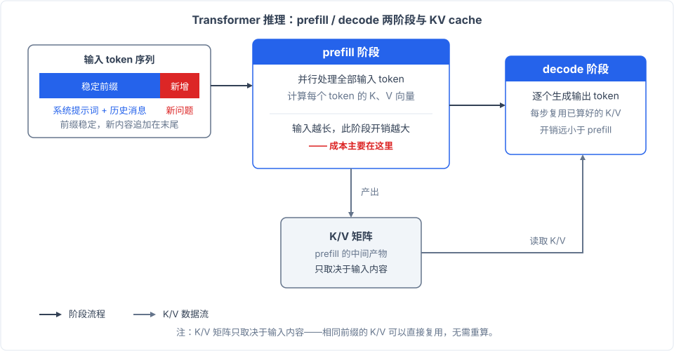
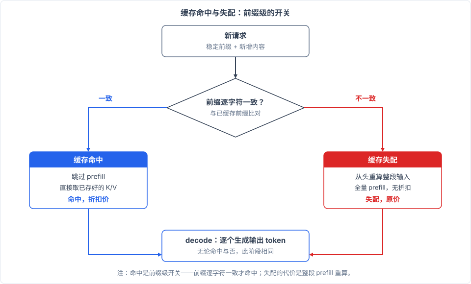

# 《什么是缓存命中》— 你早就该知道，但是总是懒得查的知识

## 这个词你天天见

调过大模型 API 的人，都见过缓存命中这个词。它出现在账单和接口的返回字段里（OpenAI 的`cached_tokens`，Anthropic 的`cache_read_input_tokens`），每家厂商的文档里也都专门讲它。你早就该知道它是什么。

它背后其实是一整条因果链，从你发出的每一条消息开始，到账单上的数字结束，一环扣一环，每一环都简单。**这条链一句话就能说完：每轮对话你都在把越攒越长的历史重新发一遍，而历史部分上次已经算过，前缀不变，服务商就把存好的结果直接拿来用、按折扣收你的钱；前缀一改，存的全部作废，从头重算**。

下面把这条链完整走一遍。

## 对话的真相

先纠正一个多数人都有的直觉。聊天界面给人的感觉是一人一句、一来一回，你问一句，它答一句，像打电话。

LLM 实际的工作方式完全不同。**它没有记忆，每一轮对话，它都要把之前所有内容连同新问题重新读一遍**。你的系统提示词、之前每一轮的问答、刚发的新消息，全部拼成一份新输入发给它。它回答第十轮问题时看到的，是前十轮的全部内容。

这意味着对话越长，输入越长。聊了几十轮的长对话、塞进几篇文档的问答，输入轻松达到几万 token。**输入越攒越长是聊天机制本身的性质**。

输入长意味着什么成本？这要看模型拿到一份输入之后是怎么算的。

## 模型怎么把输入变成输出

这一步稍微专业一点，但只需要四个概念。

第一，token 化。模型读的不是文字，是 token 序列。一份几万字的历史对话，在它眼里是几万 token 排成的长队。

第二，注意力。transformer 的核心操作是注意力：**每个 token 都要和排在它前面的所有 token 计算关联**。处理第 N 个 token 的成本随 N 增长，队伍越长，每个新成员要打交道的旧成员越多。输入越长，处理输入越贵。

第三，两个阶段。**模型处理一次请求分两个阶段：prefill 一口气处理全部输入，decode 逐个生成输出**。prefill 阶段，模型并行处理整段输入，为每个位置算出两组中间矩阵，通常叫 K 矩阵和 V 矩阵。decode 阶段，模型基于这些矩阵一个 token 一个 token 地往外写回答。你发完长提示词之后等第一个字的那几秒，等的就是 prefill。

第四，也是最关键的一个事实：prefill 算出的这些矩阵，只取决于输入内容本身。同样的前缀，无论算多少次，结果一模一样。

把这一点和上一节放在一起看，浪费就浮出水面了。你的历史对话每一轮都一字不差地重发一遍，历史部分的 prefill 于是每一轮都原封不动重算一遍。**每次对话，历史部分的 prefill 都重算了一遍，这是整条链路里最大的浪费**。

## 算过的东西不用再算

既然这些矩阵只取决于输入内容，而你的历史前缀每轮都一字不差，那这部分计算结果就是一份可以复用的资产。

**算过的东西，可以再拿来用**。

问题只剩下一个：怎么拿。

## 存下来，直接拿值

服务商的做法很直接：把 prefill 算出的 K/V 状态存下来。下次请求进来先比对前缀，如果和某次已存的前缀逐字符一致，就跳过这一段 prefill，直接拿存好的值接着算。**前缀逐字符一致就直接拿存好的值，跳过这段 prefill，这就是缓存命中**。

三个要点。

命中条件是精确匹配。[OpenAI 的文档](https://platform.openai.com/docs/guides/prompt-caching)说法是复用"exact prompt prefix"，[Anthropic 的文档](https://docs.anthropic.com/en/docs/build-with-claude/prompt-caching)说法是从特定前缀恢复。任何字符变化都会失配，哪怕只差一个标点。

命中只省 prefill。decode 照常进行，**输出内容和不缓存时完全一致**，四家厂商的官方文档都确认了这一点。也就是说，这件事没有正确性风险，只有省多省少的区别。

省掉的计算发生在服务商那边。你不需要改代码逻辑，好几家厂商甚至默认开启，你要操心的只是前缀稳不稳定。

## 这个缓存存在哪里

说到缓存，多数人会想到浏览器缓存：把响应结果存在本地，下次不用再发请求。LLM 的缓存是另一种东西。**浏览器缓存存的是响应结果，LLM 缓存存的是计算的中间状态，两者是两回事**。它存在服务商的机器上，帮你省的是下次请求里的一段计算。

存放方式各家还不一样。Anthropic 和 OpenAI 的缓存只放在内存里，不落盘，存活时间以分钟计：Anthropic 默认 5 分钟，每次命中自动免费续期；OpenAI 从 GPT-5.6 起最小保留 30 分钟，旧模型闲置 5 到 10 分钟就清除。**多数厂商只把它放在内存里存几分钟，DeepSeek 反而存在硬盘上，能放好几天**。[DeepSeek 的官方文档](https://api-docs.deepseek.com/guides/kv_cache)写明这是磁盘缓存，闲置后通常数小时到数天才清除，所以调用间隔稀疏的场景里，它的缓存反而活得下来。Gemini 官方未公布固定的存活时间，通常几分钟量级。

顺带一句隐私顾虑：如果介意缓存驻留，Anthropic 官方的零数据保留方案可以覆盖缓存，敏感场景可以去查一下。

## 落到账单上

说了这么多，这件事对你的意义最后都落在账单上。以下均为 2026-08 的每百万 token 价格。

命中读取普遍远低于正常输入价。**命中读取最低只要输入价的十分之一，DeepSeek 甚至只要未命中价的百分之二**。具体看：Anthropic 命中读取按输入价的 0.1 倍计费，Sonnet 4.6 输入 $3，命中后 $0.30；Opus 5 输入 $5，命中后 $0.50。OpenAI 的 gpt-5.6-sol 输入 $5.00，缓存输入 $0.50；gpt-5.4 输入 $2.50，缓存 $0.25。[Gemini](https://ai.google.dev/gemini-api/docs/caching) 的 2.5 Pro 输入 $1.25，缓存 $0.13；2.5 Flash 输入 $0.30，缓存 $0.03。DeepSeek 的 v4-flash 未命中 $0.14，命中只要 $0.0028（官方已预告近期涨价）。

两个附带事实。写入缓存本身可能要花钱：Anthropic 按输入价的 1.25 倍（5 分钟存活）或 2 倍（1 小时存活）收写入费，OpenAI 从 GPT-5.6 起收 1.25 倍，DeepSeek 和 Gemini 免费。所以前缀太短或只命中一两次，未必回本，各家也因此设了最小可缓存长度：Anthropic 按模型从 512 到 4096 token 不等，OpenAI 最少 1,024 token，Gemini 3 系列 4,096、2 系列 2,048，不足就静默不缓存；DeepSeek 官方文档未给出最小可缓存长度。

省的不只是钱，还有等待。命中降低的主要是首 token 延迟，因为省掉的是 prefill。Anthropic 官方给过一个例子：100K token 的文档问答，首 token 延迟从 11.5 秒降到 2.4 秒，最多降 85%；OpenAI 的官方材料称长提示词最多降 80%；Gemini 官方确认有延迟收益，未给百分比。

怎么看自己命中了多少？**账单里直接写着命中了多少 token**。Anthropic 的返回里有`cache_creation_input_tokens`和`cache_read_input_tokens`，OpenAI 有`cached_tokens`和`cache_write_tokens`，DeepSeek 有`prompt_cache_hit_tokens`和`prompt_cache_miss_tokens`，Gemini 有`cachedContentTokenCount`。

上下文越长的负载，吃到的红利越大。极端形态是长上下文的智能体循环：系统提示词和工具定义每轮不变，对话历史只增不减，命中率天然就高。长上下文本身的成本问题，我单独写过一篇：[《上下文决定智能体的上限》](../agents/context-matters.md)。

## 前缀一动，全部作废

上面这一切有一个共同的前提：前缀不能动。

**前缀里任何字符一变，存的全部作废，从头重算**。改了历史里的某一句话，这段之后的缓存全部失配；在系统提示词里塞了每轮都变的时间戳或随机 ID，每次请求都是全新的前缀，缓存一次也命不中。失配的请求回到全价 prefill，该多少就是多少。

有一个现成的真实案例。Claude Code 通过第三方端点使用其他模型时，会在每个请求的系统提示词最前面注入一行计费头（x-anthropic-billing-header），其中带一个每次请求都变化的随机哈希（cch 字段）。Anthropic 官方 API 会剥离这一行，自家缓存不受影响；但第三方兼容端点把它算作缓存前缀的一部分。于是前缀每轮都变，整个系统提示词加工具定义（数万 token）的缓存全部失配。

后果在实测里很直观：有人用第三方端点测得命中率 0%，加了一个剥离该字段的代理之后，命中率恢复到约 99.7%；另一处报告命中率从 90% 以上跌到 30% 到 40%，甚至接近 0。截至 2026 年年中这个行为仍然存在，[官方仓库的 issue](https://github.com/anthropics/claude-code/issues/68900) 还挂着。

所以这件事最后只落到一个行为建议：**把不变的内容钉在提示词开头**。系统提示词、工具定义、长文档放前面，当轮的新输入放后面，别往稳定的段落里掺每次都变的东西。

回到开头那条链。缓存命中的机制一句话就能说清，值得养成习惯的只有两件小事：写提示词时把不变的钉在开头，看账单时先看命中量。
